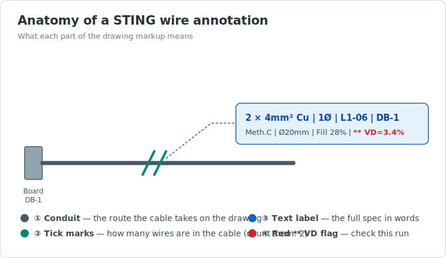
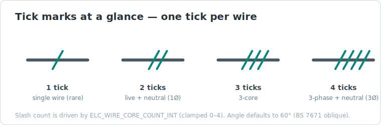
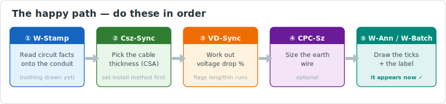
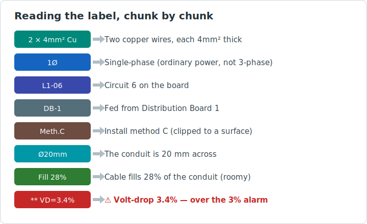
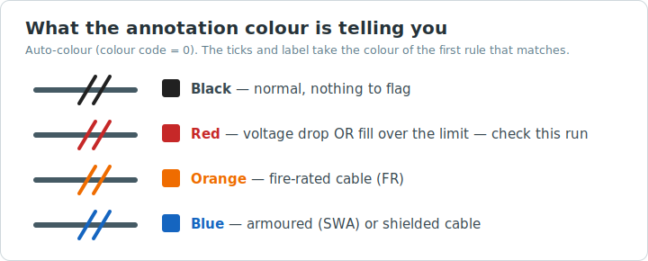
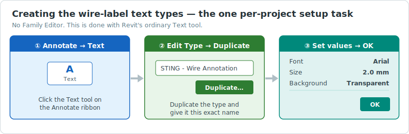

# STING Wire Annotation Workflow Guide

**Standards**: BS 7671:2018 · BS 9999:2017 · IEEE 1584-2018

> **Arc-flash note:** the IEEE 1584-2018 arc-flash calculation is pending verification against the
> licensed standard. Do not rely on arc-flash output for engineering sign-off until it has been
> reviewed by a qualified electrical engineer.

---

## Introduction to Wire Annotation

This section explains what a wire annotation is, the concepts involved, and the procedure for
producing one. It requires no prior experience with STING. The reference sections that follow
document every parameter, control, and authoring task in full.

### What a wire annotation is

On an electrical drawing, a conduit is the line representing the route a cable takes from a
distribution board to the equipment it serves. The line alone does not record what runs through it —
the number of conductors, their cross-sectional area, the conductor material, or the circuit
reference. A wire annotation records that information on the drawing, adjacent to the conduit. It
comprises two parts:

1. **Tick marks** drawn across the conduit, indicating the number of conductors in the cable. Two
   ticks denote two conductors (line and neutral); four ticks denote a three-phase cable with a
   neutral.
2. **A text label** beside the ticks giving the full specification, for example
   `2 × 4mm² Cu | 1Ø | L1-06 | DB-1` — two 4 mm² copper conductors, single phase, circuit 6 on
   Distribution Board 1.

Produced manually, this information must be entered on every conduit and every sheet and kept current
as the design develops. STING derives it from the circuit data already held in the model and writes
the annotation automatically, in a consistent BS 7671 format.



The tick marks are read at a glance — one tick per conductor in the cable:



### Key concepts

| Term | Meaning |
|---|---|
| **Conduit** | The line on the drawing representing a cable's route. STING attaches annotations to conduits. |
| **Circuit** | A run of supply from a board to the equipment it feeds. The model holds a conduit's circuit once it has been connected to a panel. |
| **CSA** | Cross-sectional area of a conductor (e.g. 4 mm²); a larger area carries more current. |
| **Voltage drop (VD%)** | The reduction in voltage along a run. BS 7671 limits it — typically 3% for final circuits — as excessive drop impairs performance. |
| **CPC** | Circuit protective (earth) conductor, sized separately from the live conductors. |
| **Ampacity** | The current a cable can carry continuously without exceeding its temperature rating. |
| **Home run** | A directional arrow indicating the conduit's return path to the board supplying the circuit. |

### Prerequisite: connect the circuit first

STING annotates only conduits whose circuit is defined in the model. The sequence is therefore:

> Draw the conduit → connect it to a panel to create its circuit → annotate.

A conduit that is not connected to a panel carries no circuit data; the stamp command reports that no
connected circuit was found. Connect it first (select the conduit → **Systems** tab → create or
assign its circuit), then proceed.

### Standard workflow

Perform these steps in order. The commands are on the **BIM** tab of the STING panel (open it from
the ribbon: **STING Tools → STING Panel**). Before first use, run **CREATE tab → Load Params** once
so the shared parameters are present. Each command operates on a selected conduit, or on every
conduit in the current view if nothing is selected.



**1. Stamp circuit data — `W-Stamp`.** Select a conduit. STING copies the circuit data (phase,
conductor count, panel name, demand current) from the model onto the conduit and confirms the values
read. No annotation is drawn at this stage. Use `W-Batch♻` to process the entire view.

**2. Size the cable — `Csz-Sync`.** Set the installation method in the `ELC_WIRE_INSTALL_METHOD_TXT`
property (Properties palette) — for example `C` (clipped direct) or `B1` (enclosed in conduit in a
wall) — as this governs the cable's current-carrying capacity. Run `Csz-Sync` to derive the
cross-sectional area, ampacity, and protective-device rating to BS 7671.

**3. Calculate voltage drop — `VD-Sync`.** With the cable sized and the route length known, STING
calculates the voltage-drop percentage and records it. Runs exceeding the limit are flagged on the
annotation.

**4. Size the protective conductor — `CPC-Sz`** (optional). Derives the earth-conductor size from the
live-conductor size to BS 7671.

**5. Place the annotation — `W-Ann`** (one conduit) or **`W-Batch`** (whole view). The ticks and
label are drawn on the drawing; `W-Batch` also offsets overlapping labels automatically.

In summary: **Stamp → Size → Voltage drop → (Protective conductor) → Annotate.** Home-run arrows,
cable schedules, and arc-flash labels are additional outputs, covered later.

### Reading the label

For the example label:

```
2 × 4mm² Cu | 1Ø | L1-06 | DB-1 | Meth.C | Ø20mm | Fill 28% | ** VD=3.4%
```



Segment by segment:

| Segment | Meaning |
|---|---|
| `2 × 4mm² Cu` | Two copper conductors, each 4 mm² |
| `1Ø` | Single phase |
| `L1-06` | Circuit 6 on the board |
| `DB-1` | Supplied from Distribution Board 1 |
| `Meth.C` | Installation method C (clipped direct) |
| `Ø20mm` | 20 mm conduit |
| `Fill 28%` | Cable occupies 28% of the conduit |
| `** VD=3.4%` | Voltage drop 3.4% — displayed because it exceeds the 3% limit; the run may require a larger conductor |

The `**` prefix and red colour indicate a value requiring attention; a compliant run displays no
voltage-drop warning. Annotation colour conveys status:



### Troubleshooting

| Symptom | Cause | Action |
|---|---|---|
| No connected circuit reported by `W-Stamp` | The conduit is not connected to a panel | Connect it (**Systems** tab), then run `W-Stamp` |
| `? Wire` in the label | The cable size has not been determined | Run `Csz-Sync` before annotating |
| No `VD=` value shown | No circuit current was available, so the value was omitted rather than estimated | Assign a load to the circuit, then run `VD-Sync` and `W-Rfsh` |
| Ticks appear too small or too large | Tick size relative to the view scale | Keep *Scale factor* at 1.0 (STING scales ticks to the view), or adjust *Slash length* |
| A command produces no result | Nothing was selected, or the view contains no conduits | Select a conduit and repeat |
| Labels no longer match the design | Annotations do not update automatically | Re-run `Csz-Sync` / `VD-Sync` as required, then `W-Rfsh` |
| Removing annotations | — | `W-Clr` removes all wire annotations from the view; conduit data is retained |

### Command quick reference

| Command | Function |
|---|---|
| `W-Stamp` / `W-Batch♻` | Copy circuit data onto conduits |
| `Csz-Sync` | Determine cable size |
| `VD-Sync` | Calculate voltage drop |
| `CPC-Sz` | Size the protective (earth) conductor |
| `W-Ann` / `W-Batch` | Place ticks and label |
| `W-Rfsh` | Update labels after changes |
| `W-Clr` | Remove labels from the view |
| `H-Run` | Place the home-run arrow |

The reference sections below document the full parameter set, style controls, standards references,
and family authoring.

---

## Overview of Capabilities

The STING wire annotation system adds 10 new commands and a set of inline dock-panel controls to the electrical workflow. Together they provide:

| Area | What STING does |
|---|---|
| **Parameter stamping** | Copies circuit data (phase, cores, panel name, demand current) from the model's electrical circuits to STING shared parameters on conduit elements |
| **Cable sizing** | Runs BS 7671 Appendix 4 derating against install method and derives CSA, ampacity, and circuit-breaker rating |
| **Voltage drop** | Calculates VD% from conduit length × CSA × conductor material; flags exceedances in the annotation label |
| **CPC / earth sizing** | Applies BS 7671 Table 54.7 to compute minimum protective conductor CSA |
| **Variable slash annotations** | Places 1–4 oblique slash marks on each conduit in the active view; slash count driven by `ELC_WIRE_CORE_COUNT_INT` (clamped 0–4) |
| **Full label** | Appends a human-readable text label: cores × CSA, material, FR/SWA/SCR flags, phase, circuit number, panel, type, install method, conduit OD, fill%, Iz/Ib, and VD alarm suffix |
| **Style control** | 3-layer style hierarchy: project JSON → per-conduit parameter overrides → view-scale auto-factor; all major dimensions editable via inline dock-panel controls |
| **Home-run arrows** | Traces the full conduit run to place a directional arrow at the panel-side end |
| **Routing validation** | Checks BS 9999 fire-segregation and BS 7671 SWA armour rules; produces a structured issues list with standard references |
| **Cable schedule** | Generates `cable_schedule.csv` and a Revit `ViewSchedule` named "STING Cable Schedule" |
| **Selective coordination stamp** | Reads TCC data and stamps `ELC_SEL_COORD_OK` on panels |
| **Arc flash labels** | Calculates incident energy per IEEE 1584-2018 polynomial model and places a NFPA 70E PPE-category warning label |

---

## New Shared Parameters

These four parameters must be bound before the new commands will write successfully. Run **Load Params** (CREATE tab) after adding them to `MR_PARAMETERS.txt`.

| Parameter | Type | Group | Purpose |
|---|---|---|---|
| `ELC_PNL_NAME_TXT` | TEXT | 4 (Electrical) | Source panel name stamped on conduit by W-Stamp |
| `ELC_PANEL_MAIN_BREAKER_TXT` | TEXT | 4 (Electrical) | Main incomer rating for TCC lookup (e.g. "250A 65kA MCCB") |
| `ELC_SEL_COORD_OK` | YESNO | 4 (Electrical) | Selective coordination pass/fail result |
| `ELC_WIRE_ARMOUR_CONT_OK_BOOL` | YESNO | 4 (Electrical) | SWA armour continuity test sign-off |

---

## New Command Tags

| Tag | Class | Gap |
|---|---|---|
| `Electrical_WireParamStamp` | `WireParamStampCommand` | 1 — stamp single conduit from circuit |
| `Electrical_BatchWireParamPopulate` | `BatchWireParamPopulateCommand` | 2 — batch stamp view/selection |
| `Electrical_WireVDSync` | `WireVDSyncCommand` | 3 — VD calculate + write back |
| `Electrical_WireCableSizerSync` | `WireCableSizerSyncCommand` | 4 — cable size + write back |
| `Electrical_CableScheduleBuild` | `CableScheduleBuilderCommand` | 5 — schedule view + CSV |
| `Electrical_HomeRunFull` | `WireHomeRunFullCommand` | 9 — full-run home-run arrow |
| `Electrical_WireSaveStyle` | `HandleWireSaveStyleFromPanel` | 7 — save inline style to project JSON |
| `Electrical_WireCpcSizer` | `WireCpcSizerCommand` | 11 — CPC / earth sizing |
| `Electrical_WireRoutingValidation` | `WireRoutingValidationCommand` | 12 — routing rule validation |
| `Electrical_WireCoordStamp` | `WireCoordStampCommand` | 13 — coordination stamp on panels |

Existing commands retained: `Electrical_WireAnnotate` (W-Ann), `Electrical_WireAnnotateBatch` (W-Batch), `Electrical_RefreshWireAnnotations` (W-Rfsh), `Electrical_ClearWireAnnotations` (W-Clr), `Electrical_WireHomeRun` (H-Run).

---

## Step-by-Step Manual Workflow

### Prerequisites

1. Open your Revit project (`.rvt`).
2. Ensure conduits are routed and circuit-connected: drawn with the Conduit tool and attached to panels as circuits (Modify → Create Circuit or similar).
3. Open the STING dock panel: ribbon → **STING Tools** → **STING Panel**.
4. Bind shared parameters: **CREATE tab → Load Params**. Confirm "Bound N parameter(s)". Re-run after adding the four new parameters above.

---

### Step 1 — Stamp circuit data onto conduits

**Purpose**: Populate `ELC_WIRE_PHASE_TXT`, `ELC_WIRE_CORE_COUNT_INT`, `ELC_CIRCUIT_NR_TXT`, `ELC_PNL_NAME_TXT`, `ELC_WIRE_CIRCUIT_TYPE_TXT`, `ELC_WIRE_COND_MAT_TXT`, and `ELC_WIRE_MAX_DEMAND_A` from the connected circuit.

**Single conduit (W-Stamp):**
1. BIM tab → **W-Stamp** (`Electrical_WireParamStamp`).
2. Pick one conduit in the active view.
3. TaskDialog confirms: circuit, panel, phase (1Ø / 3Ø), core count, demand current.
4. If the command reports that no connected circuit was found, the conduit is not circuit-connected. Attach it to a panel via the Systems tab first.

**Batch (W-Batch♻):**
1. Optionally pre-select conduits. If none selected, all conduits in the active view are processed.
2. BIM tab → **W-Batch♻** (`Electrical_BatchWireParamPopulate`).
3. A progress dialog shows with cancel (Escape) support.
4. Result: "Stamped: N / Skipped (no circuit): M."

**Phase detection** (from the circuit's system type):

| SystemType | Phase written | Cores |
|---|---|---|
| `PowerCircuit`, `UPS` | 1Ø | 2 |
| `LightingCircuit` | 1Ø | 2 |
| `ThreePhase`, `ThreePhaseDelta`, `ThreePhaseWye` | 3Ø | 4 |

Core count can be overridden manually in the Properties palette (`ELC_WIRE_CORE_COUNT_INT`). This directly controls slash count (clamped 0–4).

---

### Step 2 — Size cables

**Purpose**: Apply BS 7671 Appendix 4 derating to select cable CSA; derive ampacity and circuit-breaker rating.

**Inputs required** (set in Properties palette before running):
- `ELC_WIRE_MAX_DEMAND_A` — stamped by W-Stamp/W-Batch♻
- `ELC_WIRE_INSTALL_METHOD_TXT` — set manually: A1, A2, B1, B2, C, E, or F (per IEC 60364-5-52 / BS 7671 Table 4A2)

**Cable sizer (Csz-Sync):**
1. Optionally select conduits; if none selected, all in active view are processed.
2. BIM tab → **Csz-Sync** (`Electrical_WireCableSizerSync`).
3. Writes:
   - `ELC_WIRE_CSA_MM2_NUM` — selected cable CSA (mm²)
   - `ELC_WIRE_AMPACITY_A` — derated current rating (A)
   - `ELC_WIRE_CIRCUIT_BREAKER_A` — next standard breaker above demand current
   - `ELC_WIRE_VD_PCT_NUM` — initial VD% estimate

**kW / kVA derivation**:
- 3-phase: `kW = √3 × V × Ib × PF / 1000` (PF defaults to 0.85 if not set)
- 1-phase: `kW = V × Ib × PF / 1000`

---

### Step 3 — Calculate voltage drop

**Purpose**: Refine VD% from actual conduit length after routing. Produces the `** VD=X.X%` alarm suffix in annotations.

**VD sync (VD-Sync):**
1. Optionally select conduits; if none selected, all in active view are processed.
2. BIM tab → **VD-Sync** (`Electrical_WireVDSync`).
3. Reads the conduit length, applies material resistivity (Cu = 17.2 nΩ·m, Al = 28.3 nΩ·m), and writes the updated `ELC_WIRE_VD_PCT_NUM`.
4. VD alarm threshold is set in the wire annotation style (default 3%). Conduits that exceed it display `** VD=X.X%` in the annotation label in red (or the auto-colour override).

> **Note (accuracy):** the annotation engine's on-the-fly VD recompute (used when a stored VD isn't
> present) now reads the connected circuit's **real current and voltage**. If no real circuit current is
> available it **omits** the VD figure from the
> label and logs a warning, rather than assuming a 16 A / 230 V default and printing a
> confidently-wrong number. So a missing `VD=` on a label means "not enough data to trust a value" —
> give the circuit a load in Revit and re-run `VD-Sync` + `W-Rfsh`.

---

### Step 4 — Size the protective conductor (earth / CPC)

**Purpose**: Apply BS 7671 Table 54.7 to determine the minimum CPC cross-section.

**CPC sizer (CPC-Sz):**
1. `ELC_WIRE_CSA_MM2_NUM` must be populated (run Csz-Sync first).
2. BIM tab → **CPC-Sz** (`Electrical_WireCpcSizer`).
3. Writes `ELC_WIRE_EARTH_CSA_MM2` using:

| Phase CSA (S) | Minimum CPC |
|---|---|
| S ≤ 16 mm² | = S |
| 16 < S ≤ 35 mm² | 16 mm² |
| S > 35 mm² | S/2, rounded up to next standard size |

4. After sizing, validate adiabatically: `S_min = √(I²t) / k` where k = 143 (Cu/70°C PVC) or 115 (Al). This calculation is not automated — perform it manually or via the formula evaluator.

---

### Step 5 — Place wire annotations

**Annotation label format** (auto-built from parameters):
```
N × CSAmm² Mat [FR] [SWA] [SCR]  |  Phase  |  Circuit#  |  Panel  |  Type  |  Meth.X  |  ØD mm  |  Fill F%  |  Iz=A Ib=A  |  ** VD=X.X%
```

**Slash marks** represent core count:
- 1 slash = 1 conductor
- 2 slashes = 2-core (line + neutral)
- 3 slashes = 3-core
- 4 slashes = 4-core (3-phase + neutral)

Slashes are oblique detail lines drawn across the conduit centreline; angle, length, and spacing are all configurable (see Step 6).

**Single conduit (W-Ann):**
1. BIM tab → **W-Ann** (`Electrical_WireAnnotate`).
2. Pick one conduit.
3. Slash marks and text label are placed in the active view.

**Batch (W-Batch):**
1. Optionally pre-select conduits; if none selected, all conduits in the active view are processed.
2. BIM tab → **W-Batch** (`Electrical_WireAnnotateBatch`).
3. Each label position is checked against a per-view collision registry. When the preferred position (perpendicular offset from midpoint) overlaps an existing label or element bounding box, the label shifts along the conduit until a clear slot is found.
4. Progress dialog with Escape cancellation.

**Refresh existing (W-Rfsh):**
- **W-Rfsh** (`Electrical_RefreshWireAnnotations`) — updates all existing STING wire annotations in the active view to reflect current parameter values. Use after any Csz-Sync / VD-Sync / CPC-Sz run. Does not delete and re-place; updates text in-situ.

**Clear (W-Clr):**
- **W-Clr** (`Electrical_ClearWireAnnotations`) — removes all STING wire annotations from the active view. Conduit element parameters are not affected.

---

### Step 6 — Control annotation style

#### Style hierarchy (lowest number wins)

1. Project defaults from `STING_WIRE_ANNOT_STYLE.json` (alongside the `.rvt` file).
2. Per-conduit overrides from `ELC_WIRE_ANNOT_*` shared parameters on each conduit element.
3. View-scale auto-factor (Gap 6): when no per-conduit override and `ScaleFactor = 1.0`, the engine multiplies lengths and gaps by `viewScale / 100` so slashes remain legible at different drawing scales.

#### Inline dock-panel controls

In the BIM/Electrical section of the dock panel:

| Control | Parameter | Default | Notes |
|---|---|---|---|
| Slash length | `tbWireSlashLen` | 6 mm | Real-world model-space mm |
| Slash gap | `tbWireSlashGap` | 3 mm | Spacing between adjacent slashes along conduit axis |
| Slash angle | `tbWireSlashAngle` | 60° | 30–90°; 60° = BS 7671 oblique convention; 90° = perpendicular tick |
| Scale factor | `tbWireScaleFactor` | 1.0 | Multiplies length, gap, and label offset; also suppresses view-scale auto-factor when set per-conduit |
| Line weight | `tbWireLineWeight` | 3 | 1–16 (Revit line-weight index) |
| Label offset | `tbWireLabelOffset` | 600 mm | Perpendicular distance from conduit centreline to text label |
| Colour code | `cbWireColorCode` | 0 (auto) | 0=auto / 1=red / 2=blue / 3=orange / 4=green |
| Show VD | `chkWireShowVD` | On | Show `** VD=X.X%` suffix when VD exceeds alarm |
| Show fill | `chkWireShowFill` | On | Show `Fill X.X%` and a warning mark when conduit fill exceeds alarm |
| Compact | `chkWireCompact` | Off | Omit panel name, circuit type, install method from label |

**Auto-colour logic** (colour code = 0):
- VD > alarm threshold **or** fill > alarm → red
- Fire-rated cable → orange
- Armoured or shielded → blue
- Default → black

#### To save style as project default
1. Set values in the inline controls.
2. Click **W-Styl** / "Save style to project JSON" (`Electrical_WireSaveStyle`).
3. Values write to `STING_WIRE_ANNOT_STYLE.json` alongside the project file.
4. Click **W-Rfsh** to apply to all existing annotations.

#### To set per-conduit overrides
1. Select conduit(s) in Revit.
2. In the Properties palette, find the `ELC_WIRE_ANNOT_*` parameters and set as needed.
3. Per-conduit values override the project JSON on next W-Rfsh.

---

### Step 7 — Home-run arrows

**Purpose**: Indicate the direction back to the source panel on long conduit runs.

**Full run (HR-Full):**
1. BIM tab → **HR-Full** (`Electrical_HomeRunFull`).
2. Pick any conduit segment in the run.
3. STING traces the connected conduit run through its fittings, collecting all connected segments, then identifies the panel-side end as the one connected to electrical equipment.
4. A detail-line arrow (shaft 150 mm, arrowhead 30 mm) is placed at that endpoint. Lines are tagged comment "STING_HOME_RUN" for later identification / cleanup.
5. If no panel end is found: verify the conduit run is circuit-connected and the panel is in the Electrical Equipment category.

**Simple (H-Run):**
- **H-Run** (`Electrical_WireHomeRun`) — places an arrow from the selected end of a single picked conduit segment, without tracing the wider run.

---

### Step 8 — Validate routing

**Purpose**: Check fire-rated and armoured cable routing per BS 9999:2017 §19.3 and BS 7671:2018.

**Set conduit flags** (Properties palette):
| Parameter | Value | Meaning |
|---|---|---|
| `ELC_WIRE_FIRE_RATED_BOOL` | 1 | Fire-survival cable (MICC, FP200, BS 6387 CWZ) |
| `ELC_WIRE_ARMOURED_BOOL` | 1 | SWA / SWBA / AWA armoured cable |
| `ELC_WIRE_ARMOUR_CONT_OK_BOOL` | 1 | Armour continuity tested at both terminations |
| `ELC_WIRE_INSTALL_METHOD_TXT` | A1/A2/B1/B2/C/E/F | IEC 60364-5-52 installation method |

**Validate (Rt-Val):**
1. BIM tab → **Rt-Val** (`Electrical_WireRoutingValidation`). Read-only — no transaction.
2. Review the structured issues list:

| Rule | Trigger condition | Standard |
|---|---|---|
| FR-1 | Fire-rated cable routed in method A1 (shared conduit with other circuits) | BS 9999:2017 §19.3 / BS 7671 Reg 422.2.1 |
| FR-2 | Fire-rated cable on surface (method C) — advisory to verify ≥150 mm clearance from heat sources | BS 7671:2018 §422.2 |
| SWA-1 | SWA cable without `ELC_WIRE_ARMOUR_CONT_OK_BOOL = 1` | BS 7671:2018 §543.3 |
| SWA-2 | SWA cable in metallic containment (method A1 or A2) without bonding confirmation | BS 7671:2018 §542.2 |

**Resolve and re-validate:**
- Set `ELC_WIRE_ARMOUR_CONT_OK_BOOL = 1` after testing armour continuity.
- Change fire-rated cables from method A1 to a dedicated fire-rated containment.
- Re-run Rt-Val until zero issues.

---

### Step 9 — Generate cable schedule

**Purpose**: Produce a Revit schedule view and a CSV file for procurement / O&M handover.

**Prerequisites**: Run Steps 1–4 to ensure all `ELC_WIRE_*` parameters are populated.

**Cable schedule (Cbl-Sched):**
1. BIM tab → **Cbl-Sched** (`Electrical_CableScheduleBuild`).
2. The command:
   - Writes `cable_schedule.csv` to `<project>/_BIM_COORD/cable_schedule.csv`
   - Creates or refreshes a Revit `ViewSchedule` named "STING Cable Schedule" on the conduit category
   - Schedule columns: Length (m), Circuit Nr, Phase, Cores, CSA (mm²), Material, Ampacity, VD%, Install Method, Max Demand (A), Circuit Breaker (A), Earth CSA (mm²), Circuit Type
   - Sorted by `ELC_CIRCUIT_NR_TXT`
3. Open the schedule from Project Browser → Schedules/Quantities → "STING Cable Schedule".

Note: the schedule is recreated from scratch on each run (delete + recreate pattern) to avoid Revit's restriction on removing managed schedule fields.

---

### Step 10 — Selective coordination stamp

**Purpose**: Stamp `ELC_SEL_COORD_OK` on each panel to record that upstream/downstream TCC curves have been checked per BS 7671 §536.

**Prerequisites:**
- Place `STING_TCC_DATABASE.json` in the project data folder.
- Set `ELC_PANEL_MAIN_BREAKER_TXT` on each panel (Electrical Equipment) via the Properties palette (e.g. `"250A 65kA MCCB"`).

**Stamp (Crd-Stmp):**
1. BIM tab → **Crd-Stmp** (`Electrical_WireCoordStamp`).
2. Collects all electrical equipment in the project.
3. For each panel: looks up `ELC_PANEL_MAIN_BREAKER_TXT` in the TCC database.
   - Match found → `ELC_SEL_COORD_OK = 1`
   - No match → `ELC_SEL_COORD_OK = 0`
4. Full upstream/downstream device-pair coordination (log-log TCC interpolation via `SelectiveCoordEngine`) is run from the BIM Coordination Center commands.

TCC interpolation uses log-log linear interpolation: `ln(y0) + t·(ln(y1)−ln(y0))` where `t = (ln(x)−ln(x0)) / (ln(x1)−ln(x0))` — this is appropriate for both time-current curves and prospective fault current axes.

---

### Step 11 — Arc flash labels

**Purpose**: Calculate incident energy and PPE category per IEEE 1584-2018 and place a warning label on each panel.

**⚠ WARNING — ARC-01 OPEN ISSUE**: The polynomial coefficients in `ArcFlashEngine.cs` have not been verified against a licensed copy of IEEE Std 1584-2018 (Table 1, Equations 1 and 4). The LV arcing current coefficient appears to be from the 2002 edition. Do not use this output for engineering sign-off or label production until a qualified electrical engineer has reviewed and corrected the coefficient arrays.

**Inputs** (set in Properties palette on the panel element):
- `ELC_FAULT_KA_NUM` — available fault current (kA)
- System voltage (read from the connected circuit)
- Clearing time (ms) — from connected protective device parameters

**Engine parameters** (`ArcFlashEngine.IncidentEnergy_CalCm2`):
- `enclosureType`: 0 = open air (factor 1.0), 1 = switchgear (1.473), 2 = MCC (1.637), 3 = cable box (2.0)
- `workingDistMm`: NFPA 70E Table 130.5(C) — ≤600 V → 455 mm; ≤15 kV → 910 mm
- `gapMm`: electrode gap — typical 25 mm (LV DB), 32 mm (HV switchgear)

**Label format** (placed as text adjacent to the panel):
```
⚠ ARC FLASH HAZARD
Panel: [name]
Voltage: [V] V
Incident Energy: [X.XX] cal/cm²
Arc Flash Boundary: [X] mm
Working Distance: [X] mm
[PPE Category N] or [DANGER — EXCEEDS CAT 4]
WEAR APPROPRIATE PPE BEFORE ENERGIZING
NFPA 70E / IEEE 1584-2018
```

**PPE categories** (NFPA 70E Table 130.5(G)):

| Energy | Category |
|---|---|
| ≤ 1.2 cal/cm² | Cat 0 |
| ≤ 4.0 cal/cm² | Cat 1 |
| ≤ 8.0 cal/cm² | Cat 2 |
| ≤ 25.0 cal/cm² | Cat 3 |
| ≤ 40.0 cal/cm² | Cat 4 |
| > 40.0 cal/cm² | DANGER — de-energise before working |

Arc flash boundary (the distance at which incident energy = 1.2 cal/cm²) is found by binary search (30 iterations) in the engine.

---

## Recommended Project Workflow Sequence

For a new project, run commands in this order:

```
Load Params → W-Batch♻ → Csz-Sync → VD-Sync → CPC-Sz → Rt-Val → W-Batch → Cbl-Sched → Crd-Stmp
```

| Step | Command | What it does |
|---|---|---|
| 1 | Load Params | Bind ELC_WIRE_* shared parameters to conduit elements |
| 2 | W-Batch♻ | Stamp circuit data (phase, cores, panel, demand) from circuits |
| 3 | Csz-Sync | Size cables per BS 7671 derating; write CSA and ampacity |
| 4 | VD-Sync | Calculate VD% from actual conduit lengths |
| 5 | CPC-Sz | Size protective conductors per BS 7671 Table 54.7 |
| 6 | Rt-Val | Validate fire-rated and SWA routing rules; resolve all issues |
| 7 | W-Batch | Place wire annotations on all conduits in active view |
| 8 | Cbl-Sched | Generate cable schedule CSV and Revit schedule view |
| 9 | Crd-Stmp | Stamp selective coordination results on panels |

After any parameter changes (re-routing, circuit changes, load updates): re-run W-Batch♻ → Csz-Sync → VD-Sync → W-Rfsh.

---

## Known Limitations and Caveats

1. **ARC-01** — IEEE 1584-2018 polynomial coefficients unverified. See Step 11 warning.
2. **SYNC-12 (deferred)** — W-Rfsh is not triggered automatically after Csz-Sync / VD-Sync / CPC-Sz. Run W-Rfsh manually after any parameter update to refresh visible annotations.
3. **CPC adiabatic check** — `S_min = √(I²t) / k` must be performed manually. k = 143 for Cu/70°C PVC earth, 115 for Al.
4. **TCC database** — `STING_TCC_DATABASE.json` is not shipped; populate from manufacturer data sheets.
5. **Arc flash** — panel families must be in the Electrical Equipment category and circuit-connected for fault current to be readable.
6. **SWA bonding** — SWA-2 rule flags any SWA cable in metallic containment (method A1/A2). Set `ELC_WIRE_ARMOUR_CONT_OK_BOOL = 1` after confirming both-end bonding and continuity test.
7. **View-scale auto-factor** — applies only when no per-conduit `ELC_WIRE_ANNOT_SCALE_FACTOR` override is present and the project JSON `ScaleFactor = 1.0`. Setting a non-1.0 project default disables the auto-factor globally.

---

## Family Editor Authoring Guide

This section covers how to author the Revit families that the STING wire annotation system reads from and writes to. There are three family types involved:

| Family type | Category | Used for |
|---|---|---|
| **Conduit** (system family) | Conduit | The element STING reads and writes all ELC_WIRE_* parameters on |
| **Conduit fitting** (system family) | Conduit Fitting | Bends, tees, unions — inherits conduit parameters automatically |
| **Electrical equipment** (loadable) | Electrical Equipment | Distribution panels, MCCs — STING reads circuit data and writes `ELC_SEL_COORD_OK` and arc-flash labels |

STING places annotations as native Revit elements (detail lines + text notes with the STING_WIRE_ANN comment marker) directly in the project view. It does **not** use tag families for wire annotations. However, if you want to display ELC_WIRE_* parameters in schedules or independent tags, you need shared parameters bound to the conduit category, which is handled by **Load Params** — no Family Editor work required for conduits.

The Family Editor work described here is for **electrical equipment panels** where STING reads circuit source data and writes results.

---

### Family requirements

Producing wire annotations does not require any Family Editor work. STING draws the ticks and the
label as detail lines and text; there is no dedicated annotation family to author. The only one-time
setup a project needs is a small set of named **text types**, created with Revit's standard Text tool
(covered immediately below).

The remaining Parts author the electrical *equipment* — distribution panels (Part B) and conduit
fittings (Part F). These are full Family Editor tasks. In most projects the equipment is provided by
manufacturer content or the Revit library and no authoring is required; the procedures are given in
full, step by step, for teams that build their own. They are not a prerequisite for annotating wires.

| Task | Section | When required |
|---|---|---|
| Create the label text types | *below*, and Part E | Every project (one-time) |
| Create the annotation line styles | [Part D](#part-d--line-styles-for-wire-annotation-graphics) | Optional |
| Author distribution-panel families | [Part B](#part-b--electrical-equipment-panel-family-authoring) | Only when building bespoke panels |
| Author conduit-fitting families | [Part F](#part-f--conduit-fittings) | Only when a custom fitting is needed |

---

### Setting up the label text types

STING writes each label as a Revit text note, selecting a text type by name. The one-time task is to
create the named types so that labels render at the intended size and style. This uses the standard
Text tool, not the Family Editor.



**Procedure:**

1. On the ribbon, select **Annotate → Text**.
2. In the Properties palette (or the type selector), click **Edit Type**.
3. Click **Duplicate…** and name the new type exactly `STING - Wire Annotation`. Click **OK**.
4. Set the following, then click **OK**:

   | Setting | Value |
   |---|---|
   | Font | Arial |
   | Size | 2.0 mm |
   | Bold / Italic / Underline | Off |
   | Background | Transparent |
   | Show Border | Off |

5. Repeat **Duplicate…** to create the two remaining types, which differ only in size and colour:
   - `STING - Wire Annotation Small` — Size 1.5 mm (used for the compact label).
   - `STING - Arc Flash Warning` — Size 3.0 mm, Bold on, red text, Background opaque, Show Border on.

6. Press **Esc** to exit the Text tool. The types are not placed by hand; STING applies them when it
   draws labels.

If these types are absent, STING falls back to the project's default text type, so labels remain
functional but may not match the intended size. The full option list for all three types is given in
Part E.

---

### Part A — Conduit Type Setup (no Family Editor required)

Conduit is a Revit system family edited through the project, not the Family Editor. Correct setup is essential for STING to read diameter, fill, and routing method.

#### A1 — Create conduit types

1. Open the project → **Systems tab → Conduit → Conduit Types** (or Project Browser → Families → Conduit Types).
2. Duplicate "Standard" for each conduit specification your project uses:

| Suggested type name | Use |
|---|---|
| `EMT — 20mm` | Electrical metallic tubing |
| `EMT — 25mm` | |
| `PVC — 20mm` | Non-metallic surface conduit (method C) |
| `PVC — 25mm` | |
| `FP — 20mm` | Fire-resistant conduit for fire-rated cables |
| `SWA-Containment — 32mm` | Dedicated metallic containment for SWA cables |

3. For each type, set **Nominal Diameter** to the correct size. STING reads `BuiltInParameter.RBS_CONDUIT_DIAMETER_PARAM` which returns the conduit nominal/outer diameter — this is a system parameter set by the type, not a shared parameter.

#### A2 — Set conduit fill threshold

The IET Wiring Matters guidance recommends a maximum cable fill of 40% for three or more cables in conduit. STING reads `ELC_CDT_CBL_FILL_PCT` (a shared parameter you populate manually or via formula) and flags fill > `FillAlarmPct` (default 40%) in the annotation with a ⚠ symbol.

To populate fill automatically: use a Revit formula on a shared parameter that computes `(sum of cable areas / conduit bore area) × 100`. This is project-specific and is not automated by STING.

#### A3 — Bind ELC_WIRE_* to conduit type (not instance)

Some parameters (e.g. `ELC_WIRE_INSTALL_METHOD_TXT`) are more naturally set per conduit type than per instance. To bind a parameter to the conduit type instead of the instance:

1. Manage → **Project Parameters** → Add.
2. Shared parameter → browse to `MR_PARAMETERS.txt` → find the parameter.
3. Categories: select **Conduits**.
4. Instance / Type toggle: select **Type**.
5. Click OK.

Type-level values are inherited by all instances of that type, so setting `ELC_WIRE_INSTALL_METHOD_TXT = B1` on the type "EMT — 25mm" automatically marks all conduit runs of that type as method B1.

---

### Part B — Electrical Equipment (Panel) Family Authoring

> This section covers authoring a distribution-panel family in the Family Editor. It is required only
> when building bespoke panels; where manufacturer or Revit-library content is used, no authoring is
> needed. The full procedure follows, step by step.

The goal is a panel family that:
- Has the correct Revit electrical connectors, so circuit data flows
- Exposes the STING ELC_WIRE_* and ELC_PANEL_* shared parameters
- Has correct geometry dimensions for visual representation and annotation clearance
- Uses correct line styles and subcategory colours for drawings

#### B1 — Start from the correct template

1. **File → New → Family**.
2. Template: select **`Metric Electrical Equipment.rft`** (located in `ProgramData\Autodesk\RVT 202x\Family Templates\English_I\`).
3. This template sets category to `Electrical Equipment` and creates a default electrical connector.

Do **not** use a generic model template. STING identifies panels by the Electrical Equipment category; the family must be in that category for circuit connection and the coordination stamp to work.

#### B2 — Set family category and subcategory

1. **Family Category and Parameters** (Manage tab → Family Category and Parameters):
   - Category: **Electrical Equipment** — already set by the template
   - Part Type: **None** (panels are not parts)
   - Shared: Off (do not make the family shared unless it will be nested)
   - Room Calculation Point: On (ensures panels register in the correct room for spatial tagging)
   - Work Plane-Based: Off (panels mount to walls, not work planes)
   - Always Vertical: On

2. Add subcategories (Manage → **Object Styles → Model Objects tab → New**):

| Subcategory | Line colour | Line weight | Use |
|---|---|---|---|
| `Enclosure` | RGB 0,0,0 (black) | 3 (medium) | Main enclosure outline |
| `Door` | RGB 0,0,0 | 2 | Door swing / cover plate |
| `Busbar` | RGB 180,0,0 (dark red) | 1 | Internal busbar representation |
| `Breakers` | RGB 0,0,180 (dark blue) | 1 | MCB/MCCB representations |
| `Connector` | RGB 0,128,0 (green) | 1 | Electrical connector visibility |
| `Text` | RGB 0,0,0 | 1 | Panel annotation text in 3D views |

Assign geometry to subcategories by selecting it in the canvas → Properties → Subcategory dropdown.

#### B3 — Reference planes and parametric dimensions

Build the geometry parametrically so that a single family covers multiple physical sizes.

**Reference planes to add** (Annotate → Reference Plane):

| Name | Direction | Purpose |
|---|---|---|
| `Width L` | Vertical, left | Left edge of enclosure |
| `Width R` | Vertical, right | Right edge |
| `Height T` | Horizontal, top | Top edge |
| `Height B` | Horizontal, bottom | Bottom edge |
| `Depth F` | Toward viewer | Front face |
| `Depth R` | Away from viewer | Rear face / wall face |
| `Cable Entry` | Horizontal | Bottom cable entry zone (typ. 200 mm from bottom) |
| `Busbar CL` | Vertical, centre | Busbar centreline |

**Dimensions and parameters** (Annotate → Aligned Dimension, then label each with a parameter):

| Dimension | Parameter name | Type | Formula | Default |
|---|---|---|---|---|
| Width L to Width R | `Width` | Length | — | 600 mm |
| Height B to Height T | `Height` | Length | — | 800 mm |
| Depth F to Depth R | `Depth` | Length | — | 250 mm |
| Height B to Cable Entry | `CableEntryHeight` | Length | — | 200 mm |
| Width L to Busbar CL | `BusbarOffset` | Length | `Width / 2` | 300 mm |

All dimensions should be **Instance** parameters unless they are fixed by the enclosure type — if you are making a single-size family, make them Type parameters.

#### B4 — Geometry modelling

All geometry is created in the **Front** view (elevation) using **Extrusion** or **Solid Blend**, then given depth via the `Depth` parameter.

**Main enclosure:**
1. Front view → Annotate → Extrusion.
2. Draw a rectangle snapping to `Width L`, `Width R`, `Height B`, `Height T` planes.
3. Extrusion end = `Depth` parameter (lock it).
4. Properties → Subcategory = `Enclosure`.
5. Material = `<By Category>` (driven by project material settings).

**Door / cover plate:**
1. Draw a second rectangle 5 mm inside the enclosure on all sides (use equality constraint or individual offsets).
2. Extrusion depth = 3 mm.
3. Subcategory = `Door`.
4. Visibility: tick "Front/Back" only (hide in plan).

**Cable entry zone** (symbolic representation):
1. Annotate → Symbolic Line.
2. Draw a dashed horizontal line at the `Cable Entry` reference plane across the full width.
3. Set line style to `Hidden` (or a custom `Cable Entry` line style).
4. This makes the gland entry zone visible on elevation drawings.

**Breaker slots** (optional schematic):
1. In the **Right** elevation view, draw equally-spaced rectangle extrusions between `CableEntryHeight` and `Height T − 50 mm`.
2. Divide into N slots; lock slot height to `(Height − CableEntryHeight − 50) / N` via a parameter.
3. Subcategory = `Breakers`. Visibility: show in Front and 3D only.

#### B5 — Electrical connector

The connector defines what the circuit can connect to. STING reads circuit data from it, so the connector must match the actual supply.

1. **Annotate → Electrical Connector** (only available in the Family Editor for electrical families).
2. Place on the `Depth R` reference plane (rear face, where conduits enter).
3. In the connector properties:

| Property | Value | Notes |
|---|---|---|
| Connector Description | `Supply` | Label shown in system browser |
| System Type | `Power — Balanced` | For 3-phase DBs; use `Power — Unbalanced` for 1-phase boards |
| Phase | `Three Phase` or `Single Phase` | Must match the supply |
| Voltage | `400` (3Ø) or `230` (1Ø) | In volts |
| Apparent Load | Formula: `LoadKva * 1000` | Links to a family parameter; see below |
| Max Current | Formula: `RatedCurrentA` | In amperes |
| Number of Poles | `3` (3Ø) or `1` (1Ø) | |
| Power Factor | `0.85` | |
| Balanced Load | On | For balanced 3-phase loads |

4. Create family parameters to drive the connector:

| Parameter name | Type | Instance/Type | Default |
|---|---|---|---|
| `LoadKva` | Number | Type | 0 |
| `RatedCurrentA` | Number | Type | 0 |

Link these to the connector fields by clicking the small formula icon next to each field in the connector properties.

#### B6 — Add shared parameters

This is how STING reads and writes data on the panel family instances in the project.

Shared parameters are added at the **project** level (Manage → Shared Parameters), not in the Family Editor. However, the parameters must also be accessible from the family's **instance** properties so that the Properties palette shows them in context. The correct approach:

1. In the Family Editor → **Create → Family Types** (or Manage → Project Parameters within family context):
   - Do **not** add STING shared parameters here. Adding them inside the family creates family-local parameters that are not accessible on project instances the way project-bound shared parameters are.
2. Close and load the family into the project.
3. In the **project**, bind shared parameters: **Manage → Shared Parameters** → load `MR_PARAMETERS.txt` → select the ELC_PNL_* and ELC_WIRE_* parameters → bind to **Electrical Equipment** category.
4. All instances of the loaded panel family will now show those parameters in Properties.

Parameters STING reads from / writes to electrical equipment:

| Parameter | Type | Read/Write | Populated by |
|---|---|---|---|
| `ELC_PNL_NAME_TXT` | TEXT | Read | Set manually (panel reference designation) |
| `ELC_PANEL_MAIN_BREAKER_TXT` | TEXT | Read | Set manually (e.g. `"400A 65kA ACB"`) |
| `ELC_SEL_COORD_OK` | YESNO | **Write** | Written by Crd-Stmp command |
| `ELC_FAULT_KA_NUM` | NUMBER | Read | Set manually from protection study |
| `ELC_WIRE_PHASE_TXT` | TEXT | Read | Set manually or derived from connector |

#### B7 — Annotation text and label visibility

For panel families that display their designation label in 2D views:

1. In the Family Editor → Front view → Annotate → **Label**.
2. Add a label linked to `ELC_PNL_NAME_TXT` (which is a shared parameter — you must first bind it to the family via Manage → Project Parameters within the family before labelling).
3. Text type settings:

| Setting | Value |
|---|---|
| Font | Arial (or corporate standard) |
| Size | 2.5 mm (visible in 1:50 views) |
| Bold | On (for panel designations) |
| Colour | Black (RGB 0,0,0) |

4. Visibility: tick **Plan/RCP** and **Front/Back** — the label should be visible in plan and elevation but hidden in section and 3D.
5. Align the label to the `Busbar CL` reference plane, centred horizontally.

#### B8 — Text type for arc flash labels

STING places arc-flash labels as project-level text (not family geometry). The text type is resolved by name — STING looks for a type named `STING - Arc Flash Warning`, falling back to the first available text type if it is absent.

To create the correct type:

1. In the project (not the family): **Annotate → Text → Text Type dropdown → Edit Type → Duplicate**.
2. Name: `STING - Arc Flash Warning`.
3. Settings:

| Setting | Value | Rationale |
|---|---|---|
| Font | Arial | Universally available |
| Text Size | 3.0 mm | Legible at 1:50; large enough for safety labels |
| Bold | On | Warning label convention |
| Colour | RGB 200,0,0 | Red — safety warning |
| Background | Opaque | Ensures the label is readable over geometry |
| Show Border | On | Box around arc flash label |
| Leader Arrowhead | Arrow Filled 15° | |
| Tab Size | 10 mm | |

#### B9 — Dimensions and clearance modelling

Add clearance zones as **reference-plane-only** (no solid geometry) so they appear in clash detection without adding visual clutter:

| Zone | Dimension | Reference standard |
|---|---|---|
| Front operational clearance | Min. 1,000 mm (LV) / 1,800 mm (HV) | BS EN 61439-1 / IET On-Site Guide |
| Side cable access | Min. 600 mm | BS EN 61439 |
| Top cable access | Min. 300 mm | |
| Rear maintenance | Min. 600 mm | |

1. Create reference planes at each clearance offset from the enclosure face.
2. Name them (right-click → Name): `Clearance Front`, `Clearance Left`, etc.
3. Add a Yes/No parameter `ShowClearances` (Instance). Use the Visibility parameter on each clearance plane: assign `ShowClearances` to them.
4. In the project, turn on `ShowClearances = Yes` only in coordination views; leave `No` for production drawings.

---

### Part C — Complete Shared Parameter List for Wire Annotation

The following table lists every shared parameter that the wire annotation system reads or writes. All must be in group 4 (Electrical) in `MR_PARAMETERS.txt` and bound to the **Conduits** (or **Electrical Equipment**) category before use.

#### Conduit parameters (bind to category: Conduits)

| Parameter name | Storage type | R/W | Source | Purpose |
|---|---|---|---|---|
| `ELC_WIRE_PHASE_TXT` | TEXT | W | W-Stamp | Phase: "1Ø" or "3Ø" |
| `ELC_WIRE_CORE_COUNT_INT` | INTEGER | W | W-Stamp | Number of cores / slash count (0–4) |
| `ELC_CIRCUIT_NR_TXT` | TEXT | W | W-Stamp | Circuit number from the circuit |
| `ELC_PNL_NAME_TXT` | TEXT | W | W-Stamp | Source panel name |
| `ELC_WIRE_CIRCUIT_TYPE_TXT` | TEXT | W | W-Stamp | "Power" / "Lighting" / "UPS" |
| `ELC_WIRE_COND_MAT_TXT` | TEXT | W | W-Stamp | "Cu" or "Al" (defaults to "Cu") |
| `ELC_WIRE_MAX_DEMAND_A` | NUMBER | W | W-Stamp | Apparent current from the circuit (A) |
| `ELC_WIRE_INSTALL_METHOD_TXT` | TEXT | R | Manual | IEC 60364-5-52 method: A1/A2/B1/B2/C/E/F |
| `ELC_WIRE_CSA_MM2_NUM` | NUMBER | W | Csz-Sync | Selected cable cross-section area (mm²) |
| `ELC_WIRE_AMPACITY_A` | NUMBER | W | Csz-Sync | Derated current rating (A) |
| `ELC_WIRE_CIRCUIT_BREAKER_A` | NUMBER | W | Csz-Sync | Proposed circuit breaker rating (A) |
| `ELC_WIRE_VD_PCT_NUM` | NUMBER | W | VD-Sync | Voltage drop percentage |
| `ELC_WIRE_EARTH_CSA_MM2` | NUMBER | W | CPC-Sz | Protective conductor cross-section (mm²) |
| `ELC_WIRE_FIRE_RATED_BOOL` | YESNO | R | Manual | 1 = fire-survival cable (MICC / FP200) |
| `ELC_WIRE_ARMOURED_BOOL` | YESNO | R | Manual | 1 = SWA / SWBA / AWA armoured |
| `ELC_WIRE_SHIELDED_BOOL` | YESNO | R | Manual | 1 = screened cable (EMC / data) |
| `ELC_WIRE_ARMOUR_CONT_OK_BOOL` | YESNO | R | Manual | 1 = armour continuity tested at both ends |
| `ELC_CDT_CBL_FILL_PCT` | NUMBER | R | Manual/Formula | Cable fill percentage (IET: alarm at 40%) |
| `ELC_WIRE_ANNOT_SLASH_LEN_MM` | NUMBER | R | Per-conduit | Override slash length (mm) |
| `ELC_WIRE_ANNOT_SPACING_MM` | NUMBER | R | Per-conduit | Override spacing between slashes (mm) |
| `ELC_WIRE_ANNOT_ANGLE_DEG` | NUMBER | R | Per-conduit | Override slash angle (30–90°) |
| `ELC_WIRE_ANNOT_OFFSET_MM` | NUMBER | R | Per-conduit | Override label perpendicular offset (mm) |
| `ELC_WIRE_ANNOT_SCALE_FACTOR` | NUMBER | R | Per-conduit | Override global scale multiplier |
| `ELC_WIRE_ANNOT_LINE_WEIGHT_INT` | INTEGER | R | Per-conduit | Override line weight (1–16) |
| `ELC_WIRE_ANNOT_COLOR_CODE_INT` | INTEGER | R | Per-conduit | Override colour (0=auto/1=red/2=blue/3=orange/4=green) |
| `ELC_WIRE_ANNOT_SHOW_VD_BOOL` | YESNO | R | Per-conduit | Override: show VD% suffix |
| `ELC_WIRE_ANNOT_SHOW_FILL_BOOL` | YESNO | R | Per-conduit | Override: show fill% |
| `ELC_WIRE_ANNOT_SHOW_DIA_BOOL` | YESNO | R | Per-conduit | Override: show conduit OD |
| `ELC_WIRE_ANNOT_SHOW_AMPACITY_BOOL` | YESNO | R | Per-conduit | Override: show Iz (ampacity) |
| `ELC_WIRE_ANNOT_COMPACT_BOOL` | YESNO | R | Per-conduit | Override: compact label (omit panel, type, method) |

#### Electrical equipment parameters (bind to category: Electrical Equipment)

| Parameter name | Storage type | R/W | Source | Purpose |
|---|---|---|---|---|
| `ELC_PNL_NAME_TXT` | TEXT | R | Manual | Panel reference designation (e.g. "DB-L01-A") |
| `ELC_PANEL_MAIN_BREAKER_TXT` | TEXT | R | Manual | Main incomer rating for TCC lookup |
| `ELC_SEL_COORD_OK` | YESNO | W | Crd-Stmp | Selective coordination result |
| `ELC_FAULT_KA_NUM` | NUMBER | R | Manual | Prospective fault current at panel (kA) |

#### Conduit OD — no shared parameter needed

Conduit outer diameter is read from the Revit built-in `BuiltInParameter.RBS_CONDUIT_DIAMETER_PARAM`. This is a system parameter populated automatically from the conduit type nominal diameter. You do not need to create a shared parameter for it.

---

### Part D — Line Styles for Wire Annotation Graphics

STING creates slash marks and home-run arrows as detail lines, and sets their colour and weight through Revit's view graphic overrides. Because the appearance is overridden in the view, custom line styles are not required. However, defining the project line styles below improves visual consistency when annotations are exported to PDF or printed.

Recommended line styles (create via Manage → Additional Settings → Line Styles → New):

| Line style name | Colour | Weight | Pattern | Use |
|---|---|---|---|---|
| `STING-Wire-Slash` | RGB 0,0,0 | 3 | Solid | Wire slash marks (standard circuit) |
| `STING-Wire-Slash-FR` | RGB 200,100,0 (orange) | 3 | Solid | Fire-rated circuit slashes |
| `STING-Wire-Slash-SWA` | RGB 0,0,200 (blue) | 3 | Solid | Armoured circuit slashes |
| `STING-Wire-Slash-Alarm` | RGB 200,0,0 (red) | 4 | Solid | VD or fill alarm |
| `STING-Wire-HomeRun` | RGB 0,0,0 | 2 | Solid | Home-run arrow shaft |
| `STING-Wire-HomeRun-Head` | RGB 0,0,0 | 3 | Solid | Home-run arrowhead |

Note: STING applies colour as a view override directly on each detail line, so the line-style colour is overridden in the view. The line styles above remain useful for schedules and filters that target the slash elements by line style, and for correct layer assignment when exporting to DWG.

---

### Part E — Text Types for Wire Labels

STING creates wire annotation labels as text notes, selecting the text type by name (first match wins, otherwise the first available type):

| Text type name | Used for |
|---|---|
| `STING - Wire Annotation` | Standard circuit label |
| `STING - Wire Annotation Small` | Compact label in congested areas |
| `STING - Arc Flash Warning` | Arc flash hazard label (red, bold) |

To create these types:

1. **Annotate → Text → Edit Type → Duplicate** for each.
2. Settings for `STING - Wire Annotation`:

| Setting | Value |
|---|---|
| Font | Arial |
| Size | 2.0 mm (at 1:100) |
| Bold | Off |
| Italic | Off |
| Underline | Off |
| Width Factor | 1.0 |
| Color | Black |
| Background | Transparent |
| Show Border | Off |
| Leader Arrowhead | Arrow Filled 30° |

3. Settings for `STING - Wire Annotation Small`:
   - Same as above except Size = 1.5 mm. Used automatically by STING when `CompactLabel = true`.

4. Settings for `STING - Arc Flash Warning`:
   - Font: Arial, Size: 3.0 mm, Bold: On, Colour: RGB 200,0,0, Background: Opaque, Show Border: On.

**View-scale relationship**: text sizes are in paper-space mm. A 2.0 mm note in a 1:100 view represents a 200 mm-tall label in model space. STING's slash marks are in model space (mm) and are scaled by `ScaleFactor` and the view-scale auto-factor. The label offset (`LabelOffsetMm`, default 600 mm model space) keeps the text a fixed model-space distance from the conduit centreline — this means the label position relative to the conduit stays constant regardless of view scale, which is the correct behaviour.

---

### Part F — Conduit Fittings

> This section covers authoring a conduit-fitting family. Conduit fittings are normally provided by
> the Revit library and require no authoring; author a custom fitting only where home-run tracing
> (`H-Run`) must pass through a non-standard fitting.

Conduit fittings (bends, tees, couplings) are loadable families in the Conduit Fitting category. STING does not annotate fittings directly — ticks and labels are placed only on conduit run segments. However, fitting families must be configured correctly so that the home-run tracing used by `H-Run` can pass through them.

#### F1 — Connector requirements for home-run tracing

Home-run tracing follows the connectors on each element from one piece of conduit to the next along the run. For a fitting to be traceable:

1. Each fitting must have exactly the right number of connectors: 2 for bend/coupling, 3 for tee, 4 for cross.
2. Connector type: **Conduit**.
3. Connector radius: must match the conduit nominal radius so Revit's routing engine joins them. Set via a formula: `NominalDiameter / 2`.
4. All connectors must be placed on reference planes and the planes must be constrained to the fitting geometry — otherwise connector positions detach when the fitting is resized.

#### F2 — Family template

Use `Metric Conduit Fitting.rft`. This template pre-sets the category and includes basic connector geometry.

1. New → Family → `Metric Conduit Fitting.rft`.
2. The template includes a 90° bend geometry. Modify as needed.
3. For the connector radius parameter: create a shared parameter `NominalDiameter` (Length type, Type parameter) and add the formula `NominalDiameter / 2` to the connector radius field.
4. Load into project: the conduit routing engine will auto-use the fitting when you draw conduit.

---

### Part G — Authoring Checklist

Use this checklist before loading a new panel or conduit fitting family into a production project:

**Panel family:**
- [ ] Category = `Electrical Equipment`
- [ ] Room Calculation Point = On
- [ ] Electrical connector present with correct System Type, Phase, and Voltage
- [ ] `LoadKva` and `RatedCurrentA` parameters linked to connector
- [ ] Geometry assigned to subcategories (`Enclosure`, `Door`, `Breakers`, `Busbar`)
- [ ] Clearance reference planes created and named
- [ ] `ShowClearances` visibility parameter wired to clearance planes
- [ ] Family loaded into project and shared parameters bound at project level
- [ ] `ELC_PNL_NAME_TXT`, `ELC_PANEL_MAIN_BREAKER_TXT`, `ELC_FAULT_KA_NUM` visible in Properties palette after loading
- [ ] Verify: W-Stamp reads the panel name from the connected circuit's source equipment

**Conduit type:**
- [ ] Nominal Diameter set correctly (STING reads `RBS_CONDUIT_DIAMETER_PARAM`)
- [ ] `ELC_WIRE_INSTALL_METHOD_TXT` set at type level where appropriate
- [ ] Conduit is circuit-connected before running W-Stamp

**Text types in project:**
- [ ] `STING - Wire Annotation` exists (2.0 mm, Arial, transparent background)
- [ ] `STING - Wire Annotation Small` exists (1.5 mm, Arial, transparent background)
- [ ] `STING - Arc Flash Warning` exists (3.0 mm, Arial, red, opaque, bordered)

**Shared parameters bound:**
- [ ] All ELC_WIRE_* parameters bound to Conduits category
- [ ] ELC_PNL_NAME_TXT, ELC_PANEL_MAIN_BREAKER_TXT, ELC_SEL_COORD_OK, ELC_FAULT_KA_NUM bound to Electrical Equipment category
- [ ] Verify binding: select a conduit → Properties palette → scroll to group 4 (Electrical) and confirm STING parameters appear
